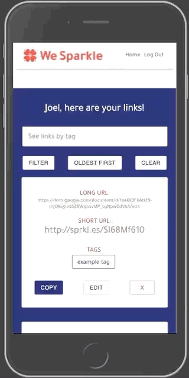
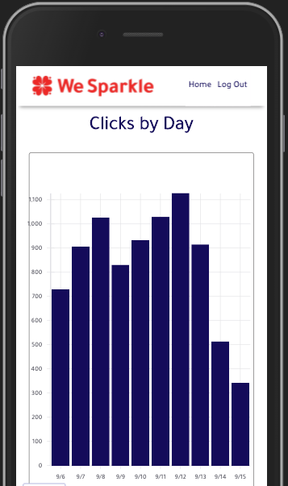

# Client Project - We Sparkle

_Duration: 3 weeks_

WeSparkle's existing Sparkle Assistant helps small business owners operate by scheduling and marketing from their phone. However, links to docs, forms, or pdf's have too many characters to share via SMS.

Rather than redirect to a third party link shortener, this application shortens links right in WeSparkle's system, provides a QR code, tagging, sorting and filtering of links, and link analytics to help business owners target marketing strategy.

## Prerequisites

Before you get started, make sure you have the following software installed on your computer:

- [Node.js](https://nodejs.org/en/)
- [PostgreSQL](https://www.postgresql.org/)
- [Nodemon](https://nodemon.io/)

## Screen Shots

### User View

## Installation

1. Create a database named `wesparkle_client`.
2. The queries in the `database.sql` file are set up to create all the necessary tables and populate the needed data to allow the application to run correctly. The project is built on [Postgres](https://www.postgresql.org/download/), so you will need to make sure to have that installed. We recommend using Postico to run those queries as that was used to create the queries. 
3. Open up your editor of choice and run an `npm install`
- Make sure you also have other dependencies installed (found in json file)
4. Run `npm run server` in your first terminal
5. Run `npm run client` in your second terminal
6. The `npm run client` command will open up a new browser tab for you!

## Usage - Unregistered User

- User enters a long link and clicks generate. This displays a shortened link within sprkl.es domain, as well as a QR code (Note: for the scope of this project, the sprkl.es domain was not yet connected to WeSparkle's server, so the short link and QR code actually redirect to the original long link. The logic is set up for the connection to a server, however)
- Unregistered users can scroll down and read about the benefits of link shortening. (Note: for the scope of the project, the email sends to a dummy email WeSparkle will set up with their admin email.)

## Usage - Registered User
- If a user registers, they will have access to a home page with a list of their shortened links with the ability to do the following:
    - copy, edit, or remove any links they have shortened.
    - sort links by creation date, starting with oldest or newest
    - filter by tags with or without sorting so they don't have to scroll through links.
    - click to edit a link, which takes users to the details page for that link. Here they can...
        - add or remove tags
        - copy or remove the link.
        - view metrics about that link (amount of clicks by day, etc.) (Note: because the domain will be connected by WeSparkle for their private use, the data for the metrics is dummy data. However, the logic is there for these features)

## Built With
- HTML
- CSS
- Javascript
- React
- Redux
- Redux-Saga
- Express
- Node.js
- PostgreSQL

## Acknowledgement
Thanks to our clients at WeSparkle, Michelle and Rachel. Thanks also to [Prime Digital Academy](www.primeacademy.io) who equipped and helped us to make this application a reality, as well as the members of our cohort, Paxos, for their support.

## Support
If you have suggestions or issues, please email me at [joel.j.roske@gmail.com](www.google.com)

## My Contribution

One of my responsibilities for this collaborative project was to be the contact for our client, scheduling meetings and communicating between our group and our client with questions and updates.

In the code, much of my involvement was on the back end. I wrote most of the logic for the routes for links, details, feedback, and tags, as well as their respective logic in the Sagas and Reducers. Much of my front end work can be seen in the LinkList, LinkListItem, LinkTags, and LinkDetails components. I also did much of the styling for the LinkTags component.

That being said, this was a full team effort, and everyone helped both where they felt comfortable and where they wanted to challenge themselves. Huge thanks to Audry Wolters, Eric Elvendahl, and Nick Simonelli for our join efforts in making this monumental effort not only manageable, but a great learning experience!

